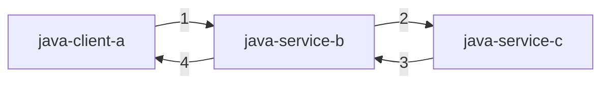
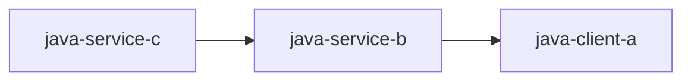

## 版本介绍

- Java 版本：8
- Dapr Java SKD 版本：0.9.2

Dapr Java-SDK [HTTP 调用文档](https://github.com/dapr/java-sdk/tree/master/examples/src/main/java/io/dapr/examples/invoke/http) 有个先决条件，内容如下：

- Dapr and Dapr CLI.
- Java JDK 11 (or greater): Oracle JDK or OpenJDK.
- Apache Maven version 3.x.

大家看到 Java JDK 版本最低要求是 11，但是本文显示使用的 JDK 8，这么做的原因是什么呢，可以[参考](https://github.com/dapr/java-sdk/issues/279) Java-SDK Issues，Issues 中回答如下：

>We want to validate that the SDK is built with Java 8 and apps can use it with Java 11.

意思是他们想通过 Java 11 写的应用程序验证 Java 8 写的 SDK 是否能正常使用。本文不需要验证 Java 11 能否使用 Java-SDK ，因此本文将使用 Java 8 构建应用程序。

## 工程结构


3 个子工程，一个 client，两个 service。新建两个 service 的意义在于展示 http 链路调用使用 dapr 如何实现。3 个工程项目都集成了 Spring Boot。Spring Boot 启动后会自动注册 Controller、Config 之类的 bean。



1. java-client-a 做为客户端调用 java-service-b；
2. java-service-b 接收请求，并调用 java-service-c；
3. java-service-c 接收请求，并响应；
4. java-service-b 收到 java-service-c 应答，并响应 java-client-a 请求。

## java-service-c

java-service-c 做为 http 调用链路末端，只需监听 http 请求即可。

``` java
package com.dapr.service;

import org.apache.commons.cli.CommandLine;
import org.apache.commons.cli.CommandLineParser;
import org.apache.commons.cli.DefaultParser;
import org.apache.commons.cli.Options;

/**
 * @author Zhang_Xiang
 * @since 2020/11/7 10:51:22
 */
public class ServiceC {

    /**
     * Starts the service.
     *
     * @param args Expects the port: -p PORT
     * @throws Exception If cannot start service.
     */
    public static void main(String[] args) throws Exception {
        Options options = new Options();
        options.addRequiredOption("p", "port", true, "Port to listen to.");

        CommandLineParser parser = new DefaultParser();
        CommandLine cmd = parser.parse(options, args);

        // If port string is not valid, it will throw an exception.
        int port = Integer.parseInt(cmd.getOptionValue("port"));

        DaprApplication.start(port);
    }
}
```

`DaprApplication.start(port);` 集成 SpringBoot 启动。

``` java
package com.dapr.service;

import org.springframework.boot.SpringApplication;
import org.springframework.boot.autoconfigure.SpringBootApplication;

/**
 * Dapr's HTTP callback implementation via SpringBoot.
 * Scanning package io.dapr.springboot is required.
 *
 * @author zhangxiang
 */
@SpringBootApplication(scanBasePackages = {"com.dapr.service"})
public class DaprApplication {

    /**
     * Starts Dapr's callback in a given port.
     *
     * @param port Port to listen to.
     */
    public static void start(int port) {
        SpringApplication app = new SpringApplication(DaprApplication.class);
        app.run(String.format("--server.port=%d", port));
    }

}
```

启动命令：

``` cmd
dapr run --app-id java-service-c --app-port 9100 --dapr-http-port 3510 -- java -jar target/dapr-java-service-exec.jar com.dapr.service.ServiceC -p 9100
```

## java-service-b

java-service-b 需要配置一个 DaprClient Bean，以在需要使用 Http 客户端的地方注入。

``` java
package com.dapr.service.config;

import io.dapr.client.DaprClient;
import io.dapr.client.DaprClientBuilder;
import org.springframework.context.annotation.Bean;
import org.springframework.context.annotation.Configuration;

/**
 * @author Zhang_Xiang
 * @since 2020/11/8 08:46:49
 */
@Configuration
public class Client {

    @Bean
    public DaprClient getClient(){
        return (new DaprClientBuilder()).build();
    }
}
```

接下来在需要调用的 Controller 中添加构造器注入。

``` java

/**
 * SpringBoot Controller to handle input binding.
 *
 * @author zhangxiang
 */
@RestController
public class HelloController {

    private final DaprClient client;
    ...

    public HelloController(DaprClient client) {
        this.client = client;
    }
    ...
}
```

发起 http 请求。

``` java
...

byte[] response = client.invokeService(SERVICE_APP_ID, "say", message, HttpExtension.POST, null,
                        byte[].class).block();
                if (response != null) {
                    ...
                }
...
```

启动命令：

``` cmd
dapr run --app-id java-service-b --app-port 9101 --dapr-http-port 3511 -- java -jar target/dapr-java-service-exec.jar com.dapr.service.ServiceB -p 9101
```

## java-client-a

对于 java-client-a 来说，集成 Springboot 是可选项，此处构造一个每隔 5 秒发起一次请求的客户端。

``` java
package com.dapr.client;

import com.alibaba.fastjson.JSON;
import com.common.ResponseResult;
import io.dapr.client.DaprClient;
import io.dapr.client.DaprClientBuilder;
import io.dapr.client.domain.HttpExtension;

import java.io.IOException;
import java.text.DateFormat;
import java.text.SimpleDateFormat;
import java.util.Calendar;
import java.util.TimeZone;

/**
 * @author Zhang_Xiang
 * @since 2020/11/7 17:30:26
 */
public class ClientA {
    /**
     * Identifier in Dapr for the service this client will invoke.
     */
    private static final String SERVICE_APP_ID = "java-service-b";

    /**
     * Format to output date and time.
     */
    private static final DateFormat DATE_FORMAT = new SimpleDateFormat("yyyy-MM-dd HH:mm:ss.SSS");

    /**
     * Starts the invoke client.
     *
     * @param args Messages to be sent as request for the invoke API.
     */
    public static void main(String[] args) throws IOException {
        try (DaprClient client = (new DaprClientBuilder()).build()) {
            while (true) {
                Calendar utcNow = Calendar.getInstance(TimeZone.getTimeZone("GMT"));
                String utcNowAsString = DATE_FORMAT.format(utcNow.getTime());
                String msg = String.format("%s:this this java client A", utcNowAsString);
                byte[] response = client.invokeService(SERVICE_APP_ID, "say", msg.getBytes(), HttpExtension.POST, null,
                        byte[].class).block();
                if (response != null) {
                    String responseResultStr = new String(response);
                    ResponseResult responseResult = JSON.parseObject(responseResultStr, ResponseResult.class);
                    System.out.println(responseResult.getMessage());
                }
                try {
                    Thread.sleep(5000);
                } catch (InterruptedException e) {
                    e.printStackTrace();
                }
            }
        }
    }
}
```

启动命令：

``` cmd
dapr run --app-id java-client-a  --dapr-http-port 3006 -- java -jar target/dapr-java-client-exec.jar com.dapr.client.ClientA
```

## 总结

各个模块的启动顺序应为：



这里限定顺序的原因是，如果先启动 java-client-a ，java-client-a 会立刻通过 dapr 开始发起请求到 java-service-b ,而这时 java-service-b 并未启动。这将触发 dapr 的重试机制。

### 重试


>服务调用在事件调用失败和瞬态错误时，将执行带避退时间间隔（backoff time periods）的自动重试。
引起重试的错误：
>
> - 网络错误，包括终端不可用和拒绝连接。
> - 身份认证错误，由于在调用方/被调用方的 dapr 边车证书更新导致。

每次重试都以 1 秒的时间避退时间为间隔，最大重试次数为 3 次。和目的地边车通过 gRPC 建立连接 5 秒超时。

java-client-a 打印：

``` cmd
== APP == This is java-service-b,receive the message:2020-11-08 14:21:14.336:this this java client A,and request java-service-c get the response:{"message":"This is java-service-c,receive the message:\"2020-11-08 14:21:14.336:this this java client A\""}
```

java-service-b 打印:

``` cmd
== APP == This is java-service-b,receive the message:2020-11-08 14:21:44.454:this this java client A
```

java-service-c 打印：

``` cmd
== APP == This is java-service-c,receive the message:"2020-11-08 14:22:19.571:this this java client A"
```

打开新的命令行窗口，输入 `dapr list`


## 启动示例

源码地址：https://github.com/ZhangX-Byte/dapr-java

克隆仓库

``` cmd
git clone https://github.com/ZhangX-Byte/dapr-java.git
cd dapr-java
```

构建 dapr-java 项目

``` cmd
mvn install
```

然后各个项目各自 install 就能正常启动了。
